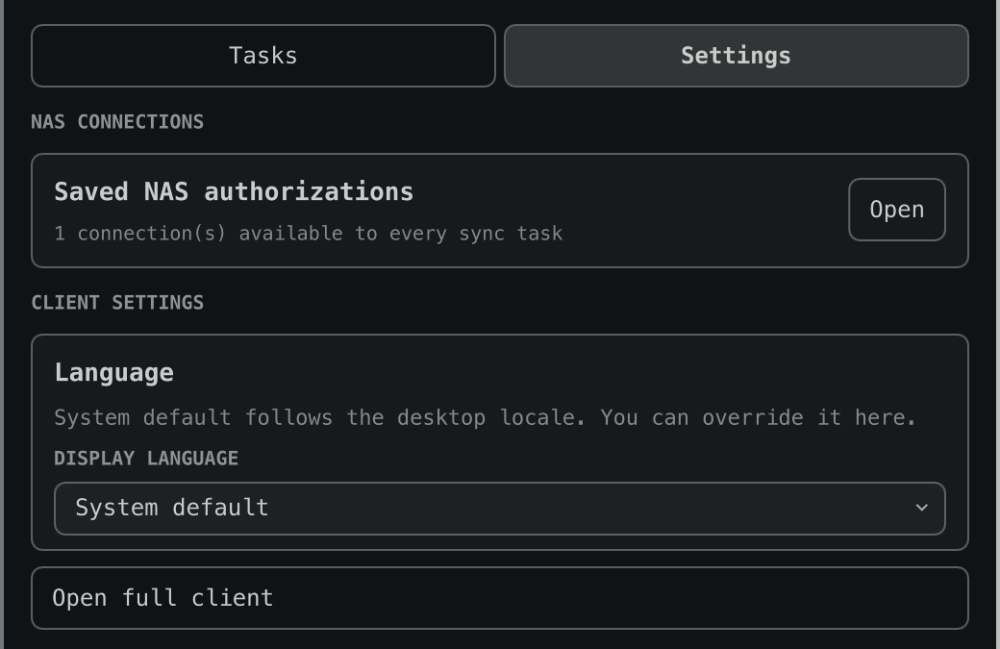

<p align="right">
  <a href="./README.md">English</a> · <strong>简体中文</strong>
</p>

# FN sync

[](https://github.com/ripple0328/fn-sync/actions/workflows/ci.yml)
[](https://github.com/ripple0328/fn-sync/actions/workflows/release.yml)

**FN sync 为 Linux 和 Omarchy 提供安全、原生的 fnOS 文件同步。**
它使用 fnOS 官方支持的 WebDAV 服务、经过验证的 rclone 传输引擎，以及用于管理
连接、任务、状态和恢复操作的 Omarchy 原生面板，不依赖 Windows/macOS 官方
客户端使用的私有协议。

应用显示名为 **FN sync**；系统界面语言为中文时显示为 **飞牛**。包名、命令和
内部路径仍使用 `fn-sync`，以保持安装与脚本兼容。

> 当前版本为 `0.9.1`。真实 fnOS 上的发现、授权、文件夹浏览和大型同步已经
> 验证。Omarchy 面板只保留“任务 / 设置”两个主导航；连接等子页使用安静、跟随
> 主题的面包屑返回导航，每个任务卡也只显示一次同步状态。首次试用仍建议从一个
> 新建的小目录开始。

## 界面

| 任务与同步状态 | 设置与已保存的 NAS 连接 |
| --- | --- |
|  |  |

## 架构

| 层 | 用途 | 是否依赖 Omarchy |
| --- | --- | --- |
| `fn-sync` 控制器 + rclone | WebDAV 传输、任务状态、冲突与删除保护 | 否 |
| systemd 用户服务 | 定时后台同步 | 否 |
| GTK 4/GJS 客户端 | 连接、任务、首次同步引导、暂停与立即同步 | 否 |
| `community.fnos-sync` 插件 | Omarchy 原生面板，以及内置的控制器和 GTK 客户端 | 是，完整自包含 |

Omarchy 插件内置控制器与 GTK 客户端，因此可以像普通插件一样安装。文件传输仍在
独立的 Python/rclone 进程中运行，不会在长期运行的 `omarchy-shell` 进程内执行；
插件也不会保存 WebDAV 密码。

插件会在加载时、每次打开面板时、操作完成后以及后台定时自动刷新状态。默认
间隔为 30 秒，可通过插件的 `refreshIntervalSec` 设置调整，因此面板不需要
手动刷新按钮。

## 功能

- NAS 连接和同步任务分离：每个 NAS 账号只授权一次，可复用于多个同步任务。
- 新建连接页面会扫描当前直连的私有局域网；确认 WebDAV 端口可用后可以自动
  填写地址，多台设备时提供选择。
- 新增授权必须先成功登录并读取文件夹才能保存。任何连接字段变更都会要求重新
  测试，测试期间不保存凭据。
- 使用原生文件夹选择器选择本地目录，并通过 NAS 文件夹浏览器选择远端目录，
  无需手工猜测路径。
- 支持双向同步、仅上传和仅下载。
- 双向任务首次通过两步引导完成：选择同名冲突要保留的一侧，运行只读的“检查
  首次同步”，然后使用唯一的“开始首次同步”主按钮。
- 首次同步检查会显示已用时间和扫描进度，但不会修改文件。检查结果会记录对应
  的冲突规则；更改规则后必须重新检查，避免检查与实际首次同步不一致。
- 首次同步成功后自动开启后台同步；开始前显示操作引导，而不是容易被误解为
  损坏或禁用的开关。
- 日常冲突保留双方，分别使用 `.Omarchy-conflictN` 和
  `.NAS-conflictN` 后缀。
- 删除前备份到版本目录；单次超过 50% 的突发删除会中止。
- 双端 `FN_SYNC_ACCESS_TEST` 访问标记会在每次双向扫描前验证。标记缺失、
  内容变化或路径不可访问时，会在扫描或修改任何文件之前暂停任务。
- 用户确认两端路径后，可使用“修复安全检查并恢复同步”；该操作只重建并验证
  FN sync 的标记，不修改其他文件。
- 任务日志超过 5 MiB 时自动轮换，仅保留一份旧日志。
- 禁止使用 `/` 或整个用户主目录，并拒绝不同任务的本地/NAS 根目录相互嵌套。
- 默认只允许 HTTPS；明文 HTTP 和跳过证书验证都需要显式选择。
- 密码优先保存在桌面 Secret Service。FN sync 只在同步时生成权限为 `0600`
  的临时 rclone 配置，使用后立即删除。
- Secret Service 不可用时回退到权限为 `0600` 的 rclone obscured 凭据；
  这种形式只是可逆混淆，不是加密。
- 默认过滤常见临时文件和 FN sync 内部版本目录。

## 在 Omarchy 上安装

使用 Omarchy 的普通命令安装并启用 Git 管理的插件：

```bash
omarchy plugin add https://github.com/ripple0328/omarchy-fn-sync.git --enable --yes
```

这是 Omarchy 用户安装飞牛所需的唯一命令。插件仓库已经包含控制器、GTK 客户端
和后台服务单元。首次打开时，如果缺少 Arch 运行组件，设置卡会通过系统认证对话框
提供安装；无需安装 AUR 软件包，也无需再运行第二条命令。该授权会明确显示，因为
Omarchy 的插件安装器按设计不会执行安装 hook 或请求提权。

之后像其他 Git 管理的 Omarchy 插件一样更新：

```bash
omarchy plugin update community.fnos-sync --yes
```

`fn-sync` Arch/AUR 软件包仍可作为非 Omarchy 桌面或纯命令行安装的可选系统级
发行方式，但不再是 Omarchy 插件的依赖。即使系统已安装该软件包，Git 插件也会
优先使用与插件同版本的内置运行组件，避免插件和客户端更新不同步。

从源码构建 pacman 包、独立插件包和便携一键安装包：

```bash
git clone https://github.com/ripple0328/fn-sync.git
cd fn-sync
./scripts/build-packages.sh
```

然后以普通桌面用户运行一键安装器；安装器只在调用 pacman 时请求 `sudo`：

```bash
./scripts/install-omarchy-bundle.sh
```

构建产物位于 `dist/`：

- `fn-sync-0.9.1-1-any.pkg.tar.zst`：Arch/pacman 系统包。
- `fn-sync-omarchy-plugin-0.9.1.tar.gz`：自包含 Omarchy 插件归档。
- `fn-sync-omarchy-bundle-0.9.1.tar.gz`：包含前两者和安装器的便携包。

安装后，状态栏右侧会显示飞牛同步官方双环标记，并打开跟随当前 Omarchy 主题的
统一面板。标记的前景色、强调色和错误色均实时绑定系统主题。面板只有“任务 /
设置”两个主入口；NAS 授权位于设置的子页，再由同步任务复用。密码仅在连接或
重新授权时通过标准输入交给控制器，不保存在任务、QML 或插件设置中。

名称和图标参考[飞牛官方软件下载页](https://fnnas.com/download?key=fn-sync)与
[飞牛同步官方帮助](https://help.fnnas.com/articles/v1/sync/how-to-use)。
Omarchy 状态栏使用官方客户端的双箭头轮廓作为透明蒙版，再由当前系统主题实时
着色；飞牛及其图标商标归原权利人所有。

界面语言默认跟随桌面区域设置：`zh*` 使用简体中文，其余语言使用英文。设置
页面也可覆盖为“跟随系统”“English”或“简体中文”；从面板打开完整客户端时会
沿用该选择。

非 Omarchy Linux 可以运行 `fn-sync ui` 使用 GTK 备用界面。

发布流水线会先通过 lint、Python/CLI/安装器测试、官方 Omarchy manifest 验证和
干净的 Arch 打包，再创建 GitHub Release。配置 AUR 专用 SSH 密钥后，同一流水线
可以把 `PKGBUILD`、`.SRCINFO` 和安装提示推送到 AUR。独立流水线会把插件
子目录发布到 `ripple0328/omarchy-fn-sync`，并保持 `manifest.json` 位于仓库
根目录。

### 用户级开发安装

不希望写入 pacman 数据库时，可以继续使用：

```bash
omarchy pkg add rclone python gjs gtk4 libsecret libnotify
./scripts/install.sh
./scripts/install-omarchy-plugin.sh
```

## 配置 fnOS

1. 在 fnOS 的文件共享协议中启用 WebDAV。
2. 优先启用 HTTPS，并记下 fnOS 显示的完整 WebDAV 地址与端口。
3. 为 Linux 同步准备一个专用子目录。
4. 建议使用只对所需共享目录有读写权限的 fnOS 用户，不要使用管理员账号。
5. 在 Omarchy 面板的“设置 → NAS 连接”子页（或 GTK 备用界面）完成一次授权，
   再创建一个或多个任务。
6. 选择冲突规则并完成“检查首次同步”，然后点击“开始首次同步”。

首次同步检查会遍历两端所有未被过滤的目录；源码树中的 `node_modules`、
`deps`、`_build`、Xcode/Android build 等生成目录会显著增加时间和 WebDAV
请求量。检查带有 `--dry-run`，不会修改文件，并可从进度卡停止。如果根目录
测试成功、但大型检查零散出现 `401 Unauthorized`，通常不是密码失效，而是
fnOS WebDAV 在密集深层请求中间歇拒绝授权。FN sync 保留 HTTPS，但禁用该连接
的 HTTP/2 多路复用，将 rclone `checkers/transfers` 降为 `2/2`，并增加重试
间隔。目录修改时间不参与文件协调，因此也不会在比较完成后逐项写回。

参考 [fnOS WebDAV 官方帮助](https://help.fnnas.com/articles/v1/file-service/webdav)。
不要把 NAS 密码发到 issue、聊天或日志中。

### 局域网自动发现

打开新的 NAS 连接表单时，插件会自动扫描当前直连的私有 IPv4 网段。扫描严格
限制为每个本地网段最多一个 `/24`，且只探测 fnOS 管理端口
`5667/5666/8001/8000` 与常见 WebDAV 端口 `5006/5005`。它只进行 TCP、
HTTP(S) 和 WebDAV `OPTIONS` 读取，不登录、不修改 NAS。

官方飞牛同步发现的是客户端管理/授权地址（当前默认 HTTPS `5667`），而本项目
通过 WebDAV 传输。因此只发现 fnOS 管理端时，表单不会猜测或填写 `5006`，而是
提示在 fnOS“设置 → 文件共享协议”中启用或检查 WebDAV。只有默认 WebDAV 端口
实际响应后才会自动填写，并且仍须通过“测试登录与文件夹”后才能保存。自定义
WebDAV 端口、跨 VLAN、VPN 和 FN ID 不会被扫描。

## 常用 CLI

从 `0.3.0` 起主命令是 `fn-sync`；旧的 `fnsync` 命令仍作为兼容别名保留，
原有 `~/.config/fnsync` 任务和密钥引用不会迁移或丢失。

```bash
fn-sync --version
fn-sync doctor
fn-sync connection add --name "Home NAS" --url https://nas.example/dav/ --username alice --password-stdin
fn-sync connection list
fn-sync connection test <connection-id>
fn-sync connection folders <connection-id> --json
fn-sync task add --name Docs --connection <connection-id> --local "$HOME/Sync/Docs" --remote-path Sync/Docs
fn-sync task repair-access <task-id> --resume
fn-sync task list
fn-sync status --json
fn-sync task test <task-id>
fn-sync task preview <task-id> --winner local
fn-sync task initialize <task-id> --winner local --apply
fn-sync task run <task-id> --dry-run
fn-sync sync-now
fn-sync logs <task-id>
```

## 与官方客户端的差异

| 功能 | 官方 Windows/macOS 客户端 | FN sync |
| --- | --- | --- |
| IP/域名连接 | 支持 | WebDAV URL |
| 同局域网自动发现 | 支持 | 支持；仅填写有响应的 WebDAV 地址并强制测试 |
| 一次授权、多任务复用 | 支持 | 支持；NAS 连接与任务分离 |
| FN ID/远程中继 | 支持 | 不支持；需要直达 fnOS WebDAV |
| 双向、仅上传、仅下载 | 支持 | 支持 |
| 首次任务体验 | 创建后立即同步 | 先做一次只读安全检查，再开始同步 |
| 按需占位文件 | 仅 Windows | 不支持 |
| 冲突处理 | 保留本地冲突副本 | 双端均保留冲突副本 |
| 状态栏与管理 UI | 官方托盘 | Omarchy 原生插件；GTK 备用界面 |
| Linux 桌面 | 无官方客户端 | GTK 客户端 + systemd 服务 |

同一 NAS 目录可以继续由 macOS/Windows 官方客户端使用，Linux 端则通过 WebDAV
访问它。不要让两个同步程序同时监视同一个 Linux 本地目录。

## 验证

- 74 个自动化测试覆盖真实 WebDAV 双向/单向传输、完整 CLI 连接与任务生命周期、
  流式进度与静默超时、后台调度、Secret Service、局域网发现、一键安装器沙箱、
  已打包控制器启动、发布源码完整性、打包/发布契约、双语文档以及独立插件测试；
  Python 行覆盖率与分支覆盖率的综合门槛为 80%。
- Omarchy 4.0 插件 manifest 与 QML 语法验证通过。
- pacman 系统包、独立插件归档和便携一键安装包完成结构校验。
- GTK/GJS 模块在无显示器环境下完成语法与导入检查。
- 基于 `rclone serve webdav` 的真实传输测试覆盖双向初始合并、双向增量、冲突
  副本、删除版本备份、访问标记中止、仅上传不传播源删除、仅下载不传播源删除。

## 已知限制

- WebDAV 不能可靠保留修改时间，所以首次合并不提供“较新文件自动胜出”。
- 当前使用周期性扫描，而不是内核文件事件加 fnOS push 的准实时协议。
- 不支持 Windows 式按需占位文件、FN ID 中继、跨网段发现和官方客户端的
  token/2FA 登录流程。
- fnOS 开放 API 目前不是外部桌面同步协议；详见[调研记录](docs/research.md)。

## 本地测试

```bash
./scripts/ci.sh
./scripts/build-packages.sh
./scripts/verify-package.sh
```

覆盖范围和仍需真实 NAS 验证的边界见 [TESTING.md](TESTING.md)。
