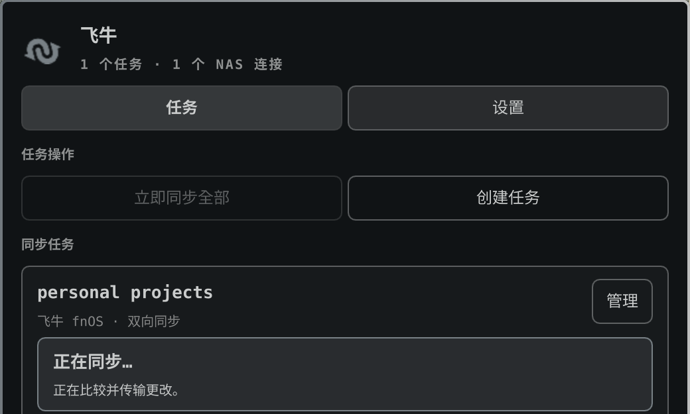

<p align="right">
  <a href="./README.md">English</a> · <strong>简体中文</strong>
</p>

# FN sync Omarchy 插件

FN sync 是一个跟随主题的 Omarchy 状态栏组件和管理面板，用于在 Linux 文件夹
与 fnOS NAS 之间同步文件。应用默认显示为 **FN sync**；系统界面语言为中文时
显示为 **飞牛**。



面板将可复用的 NAS 授权与同步任务设置分开，与官方客户端“先连接、后建任务”的
逻辑一致。只需在设置中授权一次 NAS，之后任意数量的任务都可以复用该连接。

“测试并保存”是一个原子操作：新建或编辑的授权只有在登录和根目录读取都成功后
才会写入。同步任务使用原生本地文件夹选择器和可
浏览的 NAS 文件夹选择器，无需手工输入路径。打开新 NAS 表单时还会扫描当前
直连的私有局域网；有响应的 WebDAV 端点可以自动填写地址。发现 fnOS 但没有
WebDAV 时，界面会明确标注并可打开管理页面。最终仍须成功完成登录和文件夹测试。

Omarchy 面板已经包含完整图形操作流程。插件内置 FN Sync 控制器、局域网发现助手
和后台服务。两个助手都提供 AMD64 与 ARM64 独立可执行文件，因此不再依赖系统
Python 或单独的 GTK/GJS 客户端。文件传输在独立的 rclone 进程中运行；WebDAV
密码不会保存在 QML 或插件设置中。

## 安装

像普通 Omarchy 插件一样安装：

```bash
omarchy plugin add https://github.com/ripple0328/omarchy-fn-sync.git --enable --yes
```

这是 Omarchy 上安装飞牛所需的唯一命令。如果系统没有受支持的 rclone，首次打开
的一次性设置卡会从固定的官方版本在用户数据目录准备插件私有副本，并使用插件源码
内的 SHA-256 校验值验证归档，无需管理员权限。控制器与发现助手已经包含自己的
Python 运行时；插件不需要系统 Python、AUR、GTK/GJS、管理员授权或第二条终端
命令。

## 使用要求

- 运行在 x86-64 或 ARM64 的 Omarchy，并有可用的用户级 systemd 会话。
- 一台已启用 WebDAV 的飞牛 NAS，以及能读写所选文件夹的账号。符合标准的非飞牛
  WebDAV 服务也可能可用，但当前支持和测试目标是飞牛 NAS。
- 本机能访问该 WebDAV 端点。只有在系统没有可用 rclone 时，首次下载固定版本的
  插件私有 rclone 才需要互联网连接。

Secret Service 和桌面通知均为可选功能；没有 Secret Service 时会使用 rclone 的
混淆凭据格式。

使用下面的命令更新 Git 管理的插件：

```bash
omarchy plugin update community.fnos-sync --yes
```

可选的 `fn-sync` Arch/AUR 软件包用于非 Omarchy 或系统级安装，不是本插件的
依赖。

## 卸载

先停止插件使用的后台服务，再移除插件：

```bash
unit="$HOME/.config/systemd/user/community.fnos-sync.service"
if [ -f "$unit" ] && grep -Fqx '# Managed by community.fnos-sync' "$unit"; then
  systemctl --user disable --now community.fnos-sync.service
  rm -f -- "$unit"
  systemctl --user daemon-reload
fi
omarchy plugin remove community.fnos-sync --yes
```

移除插件不会删除任一同步文件夹。用户的任务配置和日志仍保留在标准的 XDG 目录中，
除非用户另行删除。插件私有 rclone 也会保留以便重新安装；系统安装的 rclone 不会
被修改或移除。

插件使用 Omarchy 的 `Color`、`Style`、`BorderSurface`、
`KeyboardPanel`、`Button`、`TextField`、`Dropdown` 和 `Toggle`
组件，因此会自动跟随当前主题。来自控制器、NAS 和用户的动态字符串均通过显式的
`Text.PlainText` 界面显示，不会被解释成 HTML、Markdown 或远程图片资源。

## 首次同步引导

官方桌面客户端会在任务创建后立即开始同步。由于 WebDAV 在 rclone 的第一次
双向合并中无法可靠判断哪一份文件更新，本 Linux 客户端增加了一次只读安全检查。
面板把这一区别呈现为简短引导，而不是直接暴露 rclone 的 preview 和 initialize
术语。

先选择只在同名文件冲突时保留电脑端还是 NAS 端副本，再运行“检查首次同步”，
最后使用唯一的“开始首次同步”按钮。只存在于一端的文件无论选择哪一侧都会合并。
检查会记录对应的冲突规则，因此更改选择后必须重新检查。进度会实时显示，也可以
安全停止，不会修改文件。首次同步成功后会自动启用后台同步，此后才显示真正可用
的暂停/开启开关。原始 rclone 输出仍可通过“查看技术日志”用于排错，但不是用户
必须审阅的步骤。

## 安全暂停与修复

每个已初始化的双向任务都会在两端保存一个小型 `FN_SYNC_ACCESS_TEST` 标记。
FN sync 会在耗时的文件扫描前验证标记内容。如果标记缺失或变化，任务会立即暂停，
不会修改任何文件。确认界面显示的本地和 NAS 文件夹正确后，使用“修复安全检查并
恢复同步”。该操作只重建 FN sync 自己的标记、验证两份标记，然后恢复自动同步。
客户端不会静默修复，因为这样可能掩盖意外改变的远端路径。任务日志在 5 MiB 时
轮换，并保留一份旧日志。

## 自动刷新状态

状态会在组件加载、每次打开面板、操作完成后以及后台定时刷新。默认间隔为 30 秒，
可以通过插件的 `refreshIntervalSec` 设置调整，因此面板中没有手动刷新按钮。

## 安全与 Linux 功能边界

密码只会在连接或重新授权 NAS 时请求。客户端优先使用桌面 Secret Service；
Secret Service 不可用时回退到 rclone 的可逆 obscured 凭据格式。插件不保存
密码。Secret Service 和桌面通知只是可选集成，不是安装前提。

FN sync 使用 fnOS 官方支持的 WebDAV 服务，支持多任务、三种同步模式、调度、
过滤、只读检查、冲突副本、删除保护，以及限定在本机子网和已知端口的发现。
FN ID 中继、跨子网发现、官方 token/2FA 授权和按需占位文件依赖官方客户端的
私有 API，本项目不会模拟。

## 审计内置控制器

发布仓库在 [`controller/`](controller/) 中包含构建二进制时使用的完整控制器
源码和构建入口。AMD64 与 ARM64 可执行文件分别在原生 Ubuntu 24.04 GitHub
Actions 环境中，使用 Python 3.13 和 PyInstaller 6.22.0 从该目录构建。
[`BUILD-PROVENANCE.json`](BUILD-PROVENANCE.json) 记录主源码提交、工作流运行、
源码哈希和二进制哈希；GitHub 还会为每个二进制保存签名的 SLSA 构建来源证明。

可使用以下命令验证下载内容：

```bash
sha256sum -c runtime/SHA256SUMS
gh attestation verify runtime/bin/fn-sync-runtime-amd64 --repo ripple0328/fn-sync
```

AArch64 系统请改用 ARM64 文件名。本地构建方法和可复现范围说明见
[`controller/README.md`](controller/README.md)。

## 开发

```bash
python3 -m unittest discover -s tests -v
omarchy plugin validate .
```

独立仓库会在每次推送时运行这些测试、ShellCheck 和 QML 解析。主 FN sync 仓库
的发布流程会自动把插件子目录发布到独立仓库。

## 许可证

MIT。飞牛/FN 标志仍是原权利人的商标，此处仅用于标识与 fnOS 服务的兼容性。
